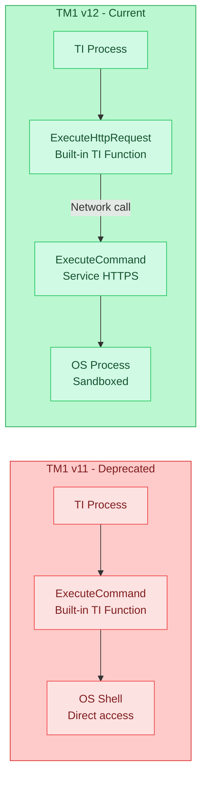
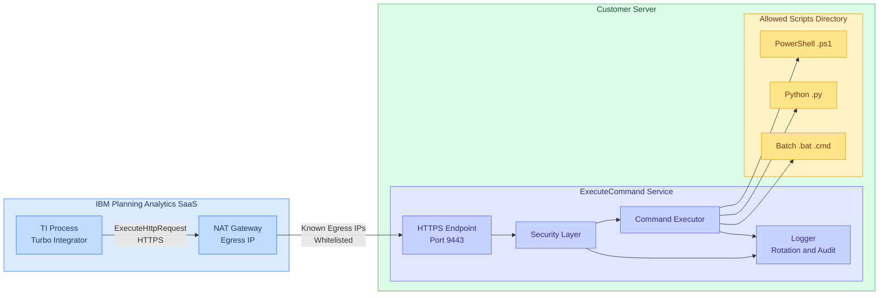
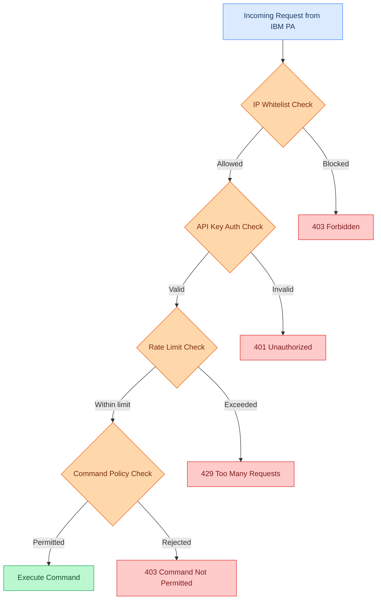
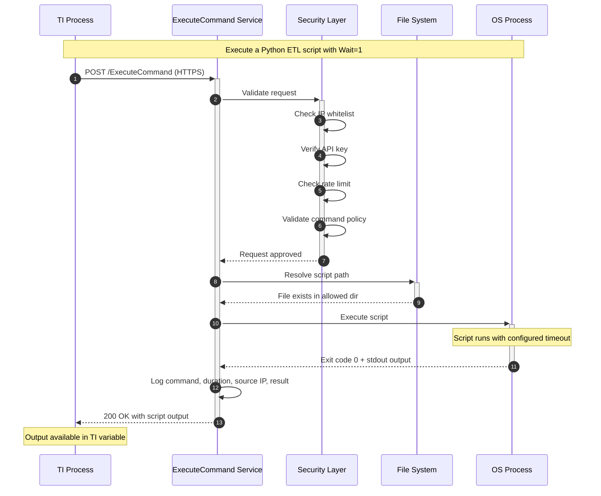

# ExecuteCommand Service — Technical Overview

## What Is It?

The ExecuteCommand Service is a lightweight, secure Windows service that bridges IBM Planning Analytics v12 (cloud) with on-premise script execution. It provides a controlled HTTP(S) endpoint that allows TM1 Turbo Integrator processes to execute pre-approved scripts on a customer's server, replacing the deprecated `ExecuteCommand` TI function from TM1 v11.

## Why Does It Exist?

TM1 v12, running in containers on IBM's cloud infrastructure, removed the built-in `ExecuteCommand` TI function. This function was widely used to trigger PowerShell scripts, Python ETL pipelines, batch files, and other automation from within TI processes.

TM1 v12 introduced `ExecuteHttpRequest` as the replacement — a function that can call any HTTP endpoint. The ExecuteCommand Service provides that endpoint, allowing existing automation to continue with minimal code changes.

### Migration Path: TM1 v11 to v12



**The migration is nearly a search-and-replace:**

```
# TM1 v11 (no longer available)
ExecuteCommand('python etl_script.py', 1);

# TM1 v12 (using ExecuteCommand Service)
ExecuteHttpRequest('POST', 'https://server:9443/ExecuteCommand',
    '-h Content-Type:application/json',
    '-h Authorization:Bearer <api_key>',
    '-d { "CommandLine":"python etl_script.py", "Wait":1 }');
```

## Architecture Overview



## Security Model — Defense in Depth

The service executes OS commands, so security is paramount. Multiple independent layers ensure that only legitimate, authorized, pre-approved scripts can be run:



### Layer 1: IP Whitelisting
Only requests from known IP addresses are accepted. IBM publishes the egress IPs for each Planning Analytics region (e.g., `3.224.15.70` for US East). All other traffic is rejected with `403 Forbidden`.

When deployed behind a load balancer or reverse proxy, the service can be configured to trust proxy-forwarded IPs from specific trusted proxy addresses only.

### Layer 2: API Key Authentication
Every request must include a Bearer token in the `Authorization` header. This shared secret is configured on the service and included in each `ExecuteHttpRequest` call from TI. Requests with missing or invalid tokens receive `401 Unauthorized`.

### Layer 3: Rate Limiting
Per-IP rate limiting prevents abuse — even from authorized sources. Configurable requests-per-minute threshold with `429 Too Many Requests` responses when exceeded.

### Layer 4: Directory-Scoped Command Policy
This is the most restrictive layer. The service will **only execute scripts that**:

- Reside in **explicitly configured directories** (e.g., `C:\Scripts\TM1`)
- Have **allowed file extensions** (e.g., `.ps1`, `.py`, `.bat`, `.cmd`)
- Contain **no shell metacharacters** (`&`, `|`, `;`, `>`, `<`, etc.)

This means:
- No arbitrary command execution — only pre-deployed script files
- No command chaining or injection — shell operators are blocked
- No path traversal — resolved paths must be within allowed directories
- Scripts are pre-planned and version-controlled by the customer's team

### Layer 5: Least-Privilege Service Account
The Windows service runs under a dedicated service account with restricted OS permissions. Even if all other layers were bypassed, the service account limits what actions can be performed on the server.

### Layer 6: HTTPS with TLS 1.2+
All traffic is encrypted using the customer's CA-issued certificate. HTTP requests are automatically redirected to HTTPS. The TLS configuration follows industry best practices with strong cipher suites.

### Layer 7: OWASP Security Headers
Every response includes security headers (Content-Security-Policy, X-Content-Type-Options, X-Frame-Options, etc.) aligned with OWASP recommendations.

## Request Lifecycle



## Configuration

All configuration is in a single `config.yaml` file:

```yaml
server:
  http_port: 8080                    # HTTP port (redirects to HTTPS)
  command_timeout_seconds: 300       # Max script execution time

logging:
  enabled: true
  file: "logs/executecommand.log"
  level: "info"                      # info or debug
  max_size: 100                      # MB before rotation
  max_backups: 3
  max_age: 28                        # Days to retain

security:
  authentication:
    enabled: true
    api_key: "your-32-char-minimum-secret-key-here"

  ip_whitelist:
    enabled: true
    allowed_ips:
      - "3.224.15.70"                # IBM PA US-East egress IPs
      - "50.19.228.111"
      - "52.45.46.218"
    trust_proxy: false               # Enable if behind a load balancer
    trusted_proxies: []              # IPs of your load balancer(s)

  command_policy:
    enabled: true
    allowed_extensions:
      - ".ps1"
      - ".py"
      - ".bat"
      - ".cmd"
    allowed_directories:
      - path: "C:\\Scripts\\TM1"
        include_subdirs: true

  rate_limit:
    enabled: true
    requests_per_minute: 60

  https:
    enabled: true
    port: 9443
    cert_file: "cert/server.crt"
    key_file: "cert/server.key"
```

## Deployment Requirements

| Requirement | Details |
|-------------|---------|
| **OS** | Windows Server 2016+ |
| **Runtime** | Single executable, no dependencies |
| **TLS Certificate** | CA-issued certificate (can reuse ODBCIS cert) |
| **Network** | Inbound access from IBM PA egress IPs on configured HTTPS port |
| **Service Account** | Dedicated Windows user with least-privilege permissions |
| **Scripts Directory** | Pre-created directory for approved scripts |

## Logging & Audit Trail

Every request is logged with:
- Unique request ID for traceability
- Source IP address
- Command requested
- Execution duration
- Success/failure status
- Timestamps in RFC 3339 format

Logs are automatically rotated by size with configurable retention. At `info` level, logs capture the operational essentials. At `debug` level, full request headers and command output are included.

## IBM PA Egress IP Addresses

For IP whitelisting, use the published egress IPs for your IBM PA region:

| Region | Egress IPs |
|--------|-----------|
| **US East (us-east-1)** | 3.224.15.70, 50.19.228.111, 52.45.46.218 |
| **EU Central (eu-central-1)** | 18.156.189.119, 3.78.118.23, 35.157.50.137 |
| **Japan (ap-northeast-1)** | 18.182.173.238, 43.206.83.4, 18.177.231.1 |
| **India (ap-south-1)** | 43.205.159.4, 3.109.53.244, 13.203.252.161 |
| **Singapore (ap-southeast-1)** | 3.1.154.5, 52.77.185.111, 54.169.45.156 |
| **Australia (ap-southeast-2)** | 3.25.4.210, 3.104.192.243, 54.79.240.176 |
| **Canada (ca-central-1)** | 15.156.223.112, 3.97.122.123, 15.222.53.148 |
| **Azure West US 3** | 4.236.35.180, 20.171.236.249 |
| **Azure Germany West Central** | 131.189.174.15, 131.189.230.173 |

Source: [IBM Documentation](https://www.ibm.com/docs/en/planning-analytics/3.1.0?topic=administering-egress-ip-addresses)
